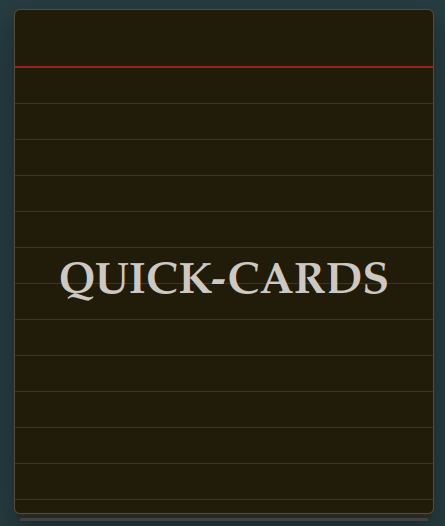

# QUICK-CARDS

## Description
This is a simple flashcard web. It's easy and very basic.  
Everyone knows how to use flashcards: You have cards, each one with a front and back side. In the front you have something like "Hg" and in the back "Mercury" so in this case you’ll to learn the symbols of the elements in the periodic table. You can use it to learn vocabulary in other languages too or anything you can imagine.

Functions:
<ul>
    <li>Add and remove cards</li>
    <li>Import and export cards group</li>
</ul>

## AI declaration
The main code was 100% made by me. BUT I wanted to tell that all the CSS was made with an AI. I began doing myself the style but I'm useless for this sort of "code". So I decided it’d be made by an AI. But the HTML and JavaScript (the important) is human-made.

 
<strong>⭐Made for the 2026 Stardance project</strong>